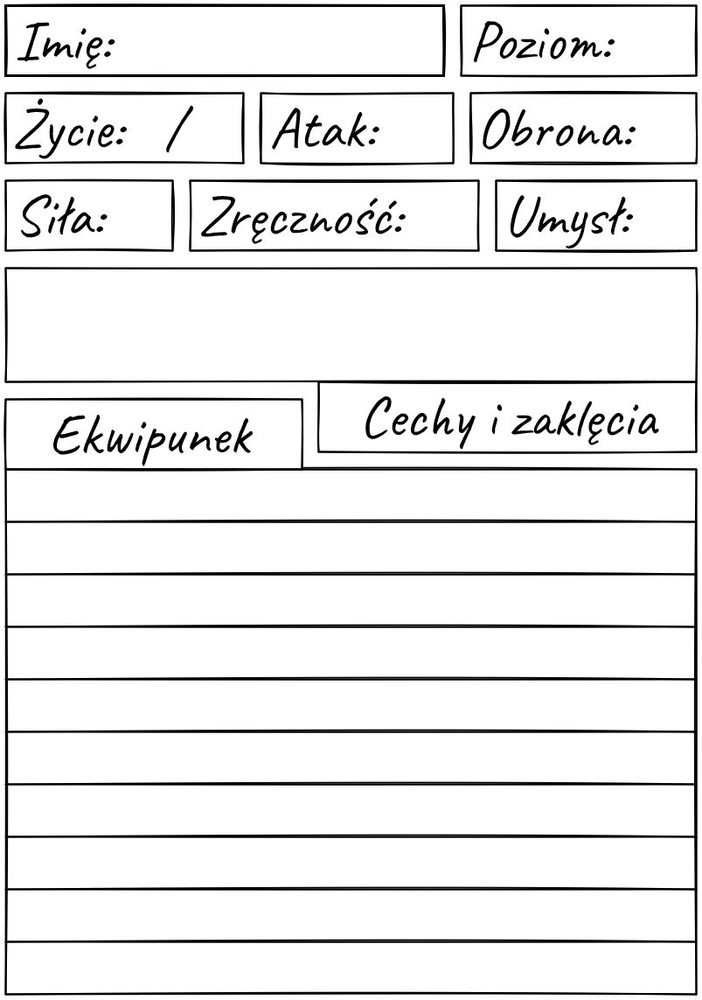

# Postać
Cała postać jest losowana.

## Statystyki
- **Siła**
- **Zręczność**
- **Umysł** (charyzma, inteligencja, siła woli)

|d|**Siła**|**Zręczność**|**Umysł**
|::|::|::|::|
||+7|+5|+3
||+7|+3|+5
||+5|+7|+3
||+3|+7|+5
||+5|+3|+7
||+3|+5|+7

- **Atak** +3
- **Obrona** 10
- **Życie** 4/4

> Nowa wersja: Nowy wynik dla statystyk i ataku to: (statystyka * 2 + 3), np. 0 -> 3, 1 -> 5, 2 -> 7
> Nowa wersja: 10 obrony

## Dodatkowe
Jedno do wyboru:
- +2 do **ataku**
- Jedno zaklęcie
- Jedna z cech (dają **ułatwienie**):
    - Przetrwanie (śledzenie, łowienie)
    - Złodziejstwo (zręczność palców, otwieranie zamków, kieszonkowstwo)
    - Atletyka (balansowanie, wspinanie się)
    - Skradanie się

## Ekwipunek
> Nowa wersja: zbroja jest +3, tarcza jest +2
Każda postać ma 10 miejsc na przedmioty i posiada:
- Lekką zbroję (+3 do **Obrony**)
- Dwa z:
    - Tarcza (1 ręka, +2 do **Obrony**)
    - Broń jednoręczna (1 ręka)
    - Broń dwuręczna (2 ręce, +1 do **obrażeń**, nie wpływa na rzut do ataku)
    - Broń zasięgbowa (2 ręce, nie można używać w bliskim zasięgu)
- Jedzenie (3 porcje)
- 3 losowe przedmioty z tabelki:

|d|Przedmiot
|::|:|
|| Fiolka kwasu 
|| Fiolka trucizny 
|| Jedzenie(3) 
|| Bandarze(2) 
|| Łańcuch(3m) 
|| Lina(15m)
|| Łom 
|| Sieć łowiecka 
|| Kotwiczka(do wspinania) 
|| Kolczatki 
|| Pułapka na niedźwiedzie
|| Kajdanki
|| Wytrychy 
|| Lampa z olejem 
|| Kilof 
|| Dobry alkohol 
|| Instrument 
|| Lornetka
|| Zwój z zaklęciem 
|| Namiot 
|| Metalowe lustro 
|| Fałszywe klejnoty 
|| Perfumy 
|| Woda święcona
|| Pochodnia 
|| Bomba dymna 
|| Pies 
|| Sokół 
|| Koń 
|| Torba(+2 miejsc)
|| Lina(15m)
|| Torba(+2 miejsc)
|| Pułapka na niedźwiedzie
|| Zwój z zaklęciem 
|| Kolczatki 
|| Fiolka trucizny 

## Nowe poziomy
|Poziom|Dodatki|
|::|:|
|2| +2 życia, +1 do statystyki
|3| +2 życia, *jedno z dodatkowych*
|4| +2 życia, +1 do statystyki
|5| +2 życia, *jedno z dodatkowych*
|6| +2 życia, +1 do statystyki
|7| +2 życia, *jedno z dodatkowych*

## Karta postaci
